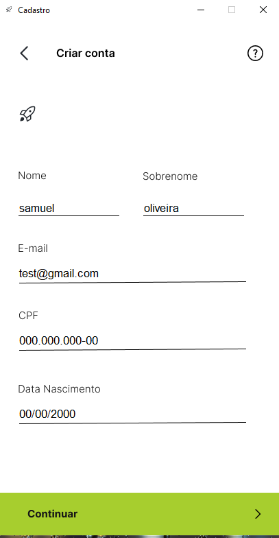
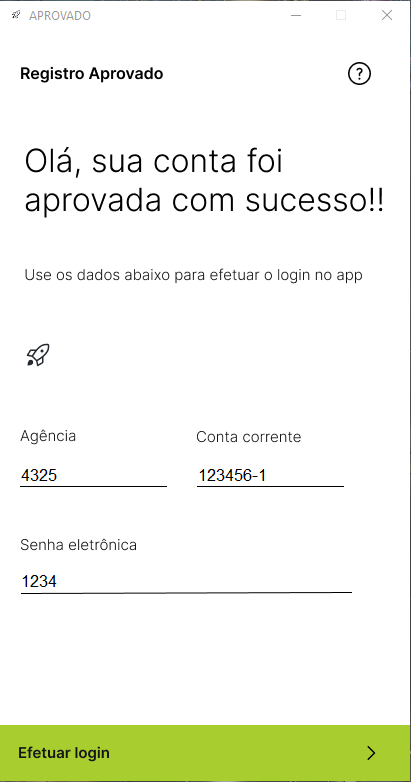
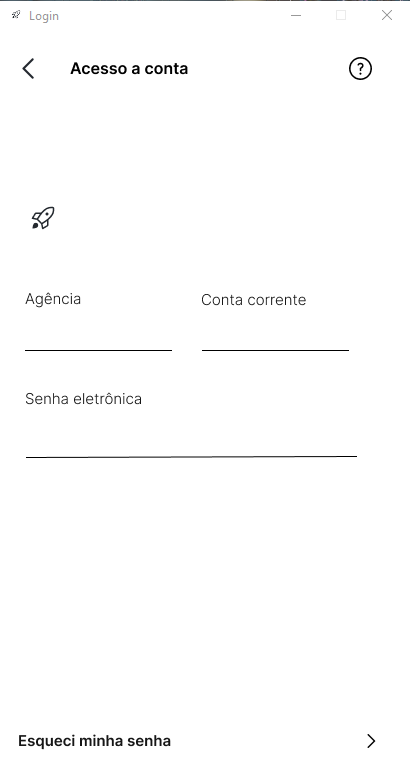

# App Two Bank MVP

<!---Esses são exemplos. Veja https:/shields.io para outras pessoas ou para personalizar este conjunto de escudos. Você pode querer incluir dependências, status do projeto e informações de licença aqui--->

Libs Utilizadas:
    pysimplegui
    pyautogui

### Progresso

> Tela Home

> Tela Cadastro

>Tela de aprovacao

> Tela Login
