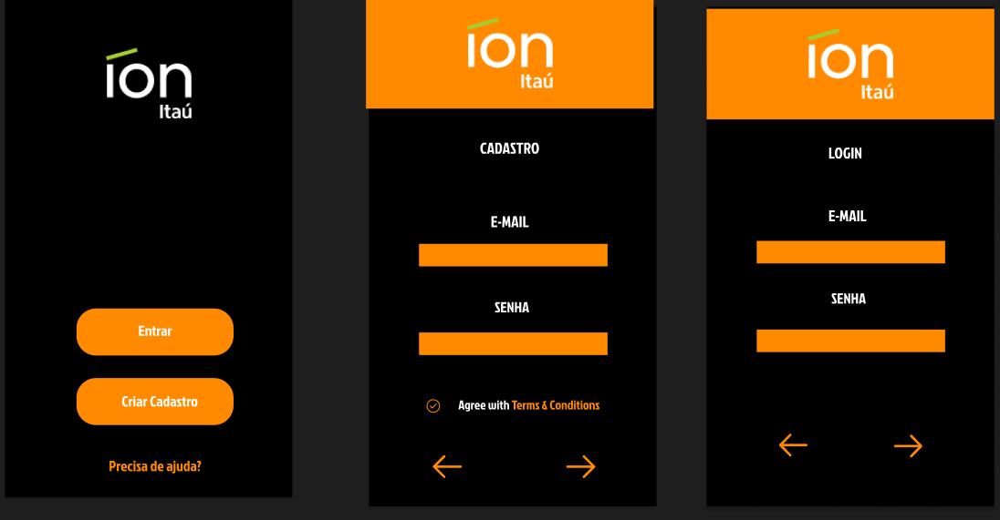

# Login Desktop

<!---Esses são exemplos. Veja https://shields.io para outras pessoas ou para personalizar este conjunto de escudos. Você pode querer incluir dependências, status do projeto e informações de licença aqui--->

> Sistema de login para desktop.

### Progresso

> Desenvolvi duas telas responsaveis pela interacao com o usuario.

