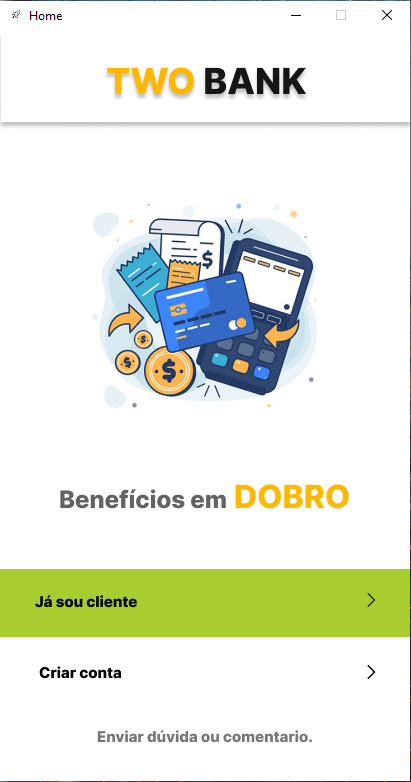

# Clone App Bancario Ion Itau

<!---Esses são exemplos. Veja https:/shields.io para outras pessoas ou para personalizar este conjunto de escudos. Você pode querer incluir dependências, status do projeto e informações de licença aqui--->


> Um clone ou quase isso do app Ion Itau.<br>
> Projeto foi pensando e desenvolvido com o proposito de praticar e aplicar conceitos tecnicos de programacao.<br> Sem Fins lucrativos ou algo para prejudicar a marca..

# Projeto Nao finalizado em fases de desenvolvimento e testes.

### Progresso
> Desenvolvi duas telas responsaveis pela interacao com o usuario.



> Tela de cadastro, login e de conta aprovada!!


### Como Usar localmente

```shell
abrir o git e da um git clone https:/github.com/SamuelFLM/Clone-App-Ion-Itau.git
Abrir o Projeto e executar Interface_home.exe
```


```shell
Baixar o projeto 
Abrir o Projeto e executar Interface_home.exe
```


